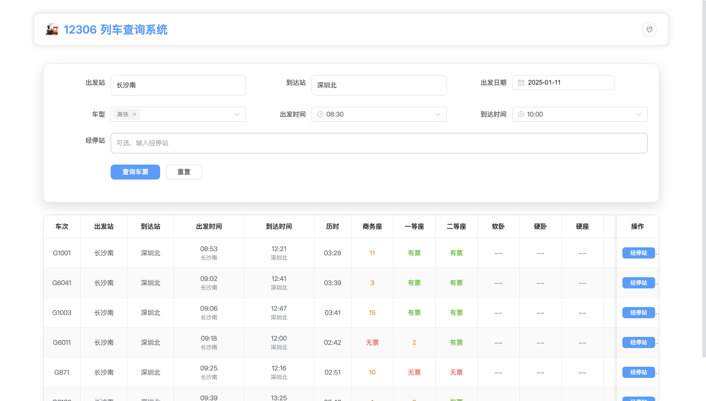
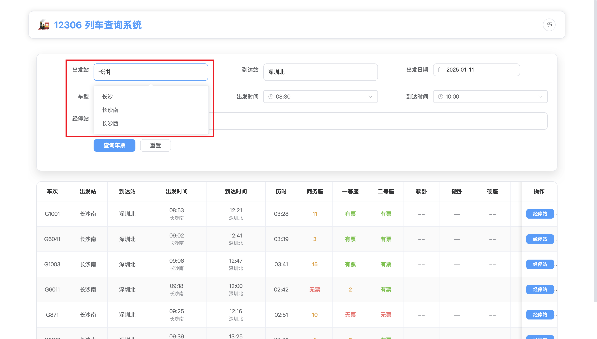
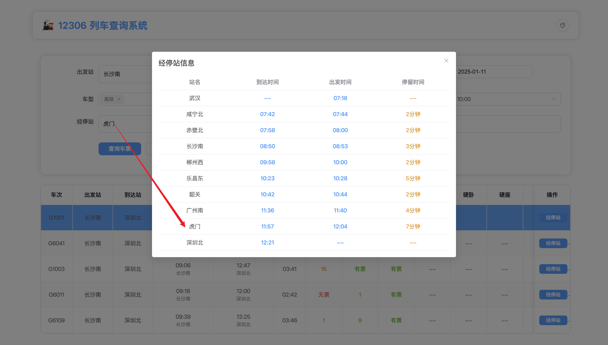

# 12306 列车查询系统


一个基于FastAPI和Vue 3的现代化列车查询系统，提供实时的列车票务查询服务。

## 功能特点

- 🚄 实时列车查询
  - 支持车次查询
  - 支持站点查询
  - 支持经停查询
  - 显示票价信息

- 🎨 现代化界面
  - 响应式设计
  - 深色模式支持
  - 主题定制
  - 优雅动画

- ⚡️ 高性能
  - 异步处理
  - 智能缓存
  - 延迟加载
  - 虚拟滚动

- 🔒 安全可靠
  - 输入验证
  - 请求限制
  - 错误处理
  - 安全头部

## 技术栈

### 后端
- FastAPI - Python Web框架
- Pydantic - 数据验证
- aiohttp - 异步HTTP客户端
- uvicorn - ASGI服务器

### 前端
- Vue 3 - 渐进式JavaScript框架
- Vite - 前端构建工具
- Element Plus - UI组件库
- Pinia - 状态管理
- VueUse - Vue组合式API工具集
- Tailwind CSS - 原子化CSS框架

## 快速开始

### 1. 克隆项目

```bash
git clone https://github.com/Zengwenliang0416/12306QueryMaster.git
cd 12306QueryMaster
```

### 2. 后端设置

```bash
# 进入后端目录
cd backend

# 创建虚拟环境
python -m venv venv

# 激活虚拟环境
source venv/bin/activate  # Linux/macOS
venv\\Scripts\\activate   # Windows

# 安装依赖
pip install -r requirements.txt

# 启动开发服务器
uvicorn app.main:app --reload --host 0.0.0.0 --port 8001
```

### 3. 前端设置

```bash
# 进入前端目录
cd frontend

# 安装依赖
npm install

# 启动开发服务器
npm run dev

# 构建生产版本
npm run build
```

## 项目结构

```
.
├── backend/                # 后端项目目录
│   ├── app/               # 应用代码
│   │   ├── api/          # API路由
│   │   ├── core/         # 核心功能
│   │   ├── models/       # 数据模型
│   │   ├── schemas/      # Pydantic模型
│   │   ├── services/     # 业务逻辑
│   │   └── utils/        # 工具函数
│   ├── tests/            # 测试代码
│   └── requirements.txt   # 依赖管理
│
├── frontend/              # 前端项目目录
│   ├── src/              # 源代码
│   │   ├── components/   # Vue组件
│   │   ├── stores/       # 状态管理
│   │   ├── styles/       # 样式文件
│   │   └── utils/        # 工具函数
│   ├── public/           # 静态资源
│   └── package.json      # 依赖管理
│
├── docs/                 # 项目文档
└── README.md            # 项目说明
```

## 环境配置

### 后端环境变量

创建 `.env` 文件在 `backend` 目录：

```env
# 服务配置
HOST=0.0.0.0
PORT=8001
DEBUG=True
```

### 前端环境变量

创建 `.env` 文件在 `frontend` 目录：

```env
VITE_API_BASE_URL=/api
VITE_APP_TITLE=12306列车查询
```

## API文档

API文档使用Swagger UI提供，启动后端服务后访问：

```
http://localhost:8001/docs
```

详细的API文档请参考 [API文档](docs/api.md)。

## 开发指南

详细的开发指南请参考 [开发指南](docs/development.md)。

## 部署指南

详细的部署指南请参考 [部署指南](docs/deployment.md)。

## 功能展示

### 车票查询


### 站点查询


### 经停查询


## 贡献指南

1. Fork 项目
2. 创建功能分支 (`git checkout -b feature/AmazingFeature`)
3. 提交更改 (`git commit -m 'Add some AmazingFeature'`)
4. 推送到分支 (`git push origin feature/AmazingFeature`)
5. 提交Pull Request

## 更新日志

### v1.0.0 (2024-01-08)
- 项目初始化
- 实现第一代车票查询脚本
- 完成后端基础接口开发
  - 车次查询功能
  - 经停站信息查询
  - 经停站筛选功能
- 完善后端文档

### v1.1.0 (2024-01-09)
- 前后端联调完成
- 新增功能
  - 显示座位和余票情况
  - 站点查询功能
  - 经停站过滤功能
- 性能优化
  - 优化查询性能
  - 统一环境配置
- 界面优化
  - 添加前端样式
  - 优化前端界面
  - 完善状态管理

## 许可证

本项目采用 MIT 许可证 - 查看 [LICENSE](LICENSE) 文件了解详细信息。

## 联系方式

- 项目维护者：曾文亮
- 邮箱：wenliang_zeng416@163.com
- 项目链接：https://github.com/Zengwenliang0416/12306QueryMaster

## 致谢

- [12306](https://www.12306.cn/index/)

- [FastAPI](https://fastapi.tiangolo.com/)
- [Vue.js](https://vuejs.org/)
- [Element Plus](https://element-plus.org/)
- [Tailwind CSS](https://tailwindcss.com/) 